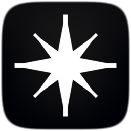
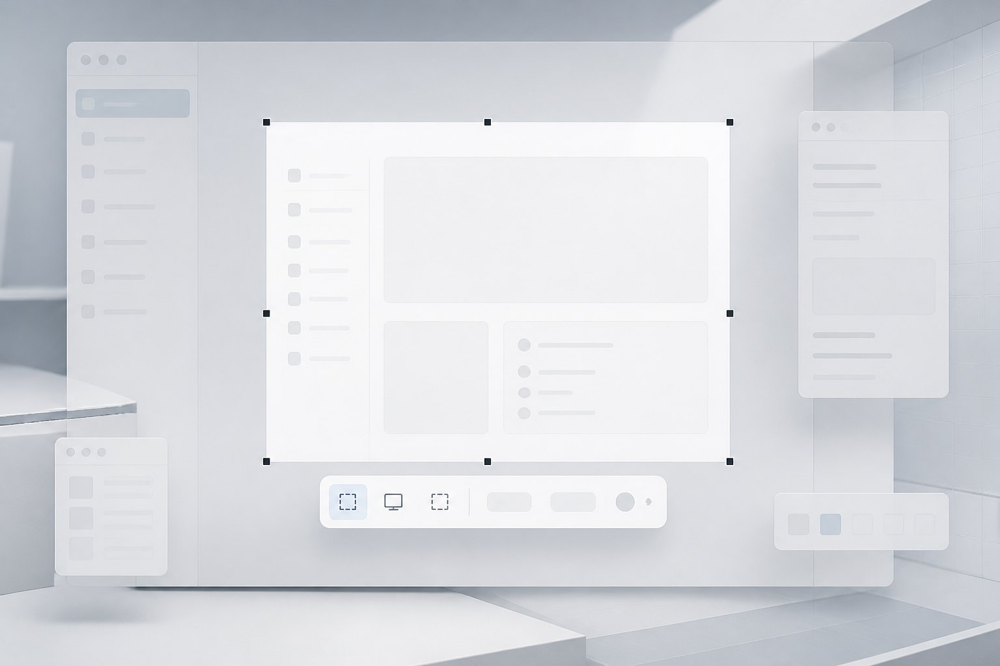
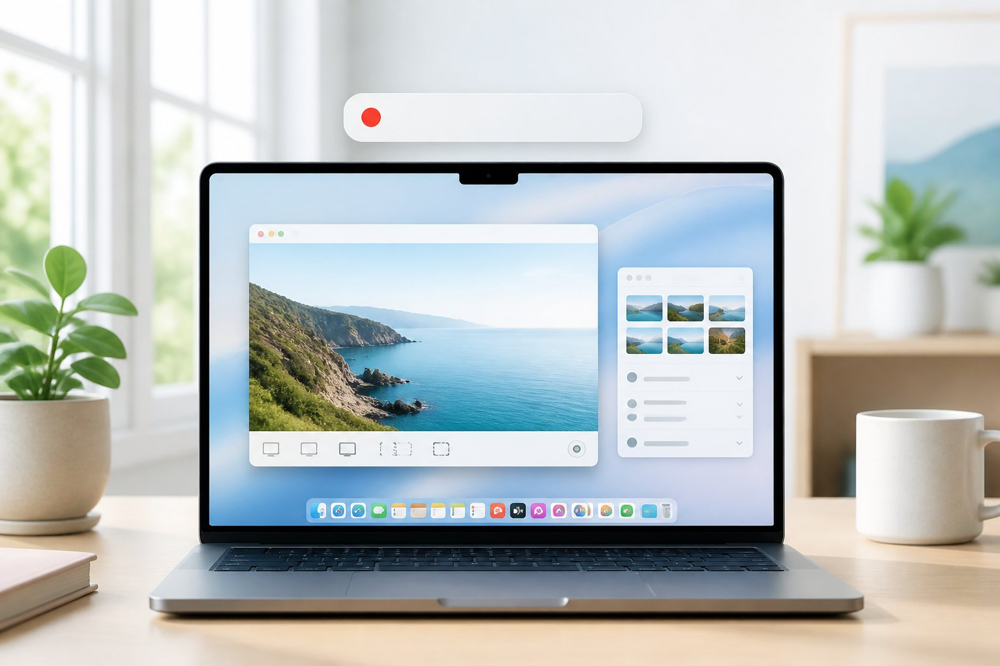
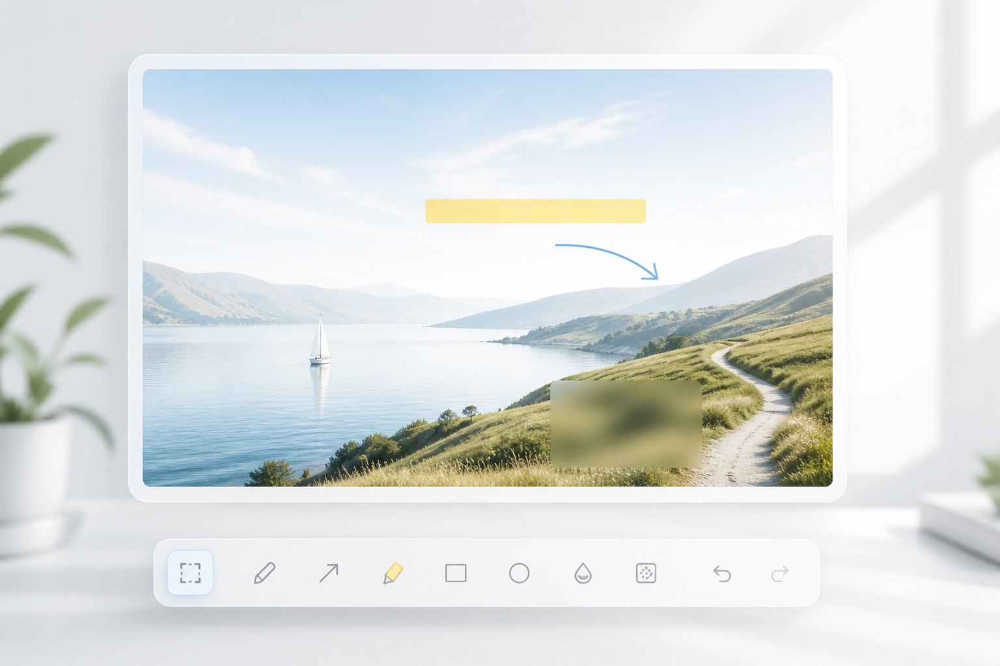

<p align="center">
  
</p>

<h1 align="center">Flare Pro</h1>

<p align="center">
  <strong>一拍即得</strong> — 原生 macOS 截图与屏幕录制<br/>
  菜单栏单击即截 · 独立录制菜单 · 标注 / OCR / 钉图 / 历史
</p>

<p align="center">
  <b>中文</b> · <a href="README.en.md">English</a>
</p>

<p align="center">
  <a href="https://github.com/linux503/Flare/releases/latest"></a>
  <a href="https://github.com/linux503/Flare/releases"></a>
  <a href="https://github.com/linux503/Flare/releases"></a>
</p>

<p align="center">
  <a href="https://github.com/linux503/Flare/releases/download/v1.3.6/Flare-Pro-1.3.6-Universal.dmg"><strong>下载 DMG</strong></a>
  ·
  <a href="https://linux503.github.io/Flare/">官网</a>
  ·
  <a href="https://github.com/linux503/Flare/releases">全部版本</a>
</p>

---

<p align="center">
  
  
  
</p>

<p align="center"><sub>截图 · 录屏 · 标注</sub></p>

---

## 它能做什么

Flare Pro 是给 macOS 用的原生屏幕工具：截得快、录得清、改得完。不依赖 Electron，一份 Universal 安装包同时支持 Apple Silicon 与 Intel。

| 模块 | 说明 |
|------|------|
| **截图** | 区域、窗口、全屏、延时 3 秒。选区带放大镜与取色、尺寸参考；空格 / 回车 / 双击确认 |
| **录屏** | 全屏或框选区域，导出 H.264 MOV。声音可选关闭 / 系统 / 麦克风 / 同时（默认关闭） |
| **标注** | 画笔、高亮、箭头、直线、矩形、椭圆、文字、马赛克、序号、步骤 |
| **OCR** | 识别画面文字，导出 TXT |
| **钉图** | 把截图钉在桌面随时对照 |
| **历史** | 最近截图三列卡片，单击打开编辑，可复制或删除 |
| **新建** | 一键创建 TXT / Word / PPT / Excel |
| **外观** | 黑白半透明主题，窗口透明度可调；设置里可检查更新 |

### 截图

- 菜单栏图标**单击** = 区域截图
- 截图后可选：打开编辑器、复制到剪贴板、保存文件、钉在屏幕上
- 同时复制到剪贴板、提示音、放大镜均可开关
- 保存格式：PNG / JPEG / TIFF，目录可自定义

### 录屏

- 顶部「录制」菜单、主面板录制页、状态栏红点计时
- 清晰度：流畅 720p · 标准 1080p · 高清 · 超清
- 帧率 15 / 24 / 30 / 60；倒计时 关 / 3 / 5 / 10 秒
- 可显示鼠标指针、排除 Flare 窗口、开始时隐藏本应用
- 悬浮计时条**不会进入成片**；暂停会跳过时间轴，不冻帧
- `Esc` 全局停止；录制中退出会询问保存 / 丢弃 / 取消

### 主面板

侧栏四个任务：**截图** · **录制** · **新建** · **历史** · **设置**。Dock 图标或 `⌘O` 打开。

---

## 快捷键

默认使用 **⌘⌥**，避开系统截图 ⌘⇧3 / 4 / 5。可在「设置 → 快捷键」里改。

| 功能 | 默认 |
|------|------|
| 区域截图 | `⌘⌥5` |
| 全屏截图 | `⌘⌥4` |
| 窗口截图 | `⌘⌥6` |
| 延时截图 | `⌘⌥3` |
| 开始 / 停止录屏 | `⌘⌥R` |
| 历史记录 | `⌘⌥H` |
| 主面板 | `⌘O` |
| 确认选区 | `空格` / `回车` / 双击 |
| 停止录制 | `Esc` |
| 暂停 / 继续 | `⌘P` |

菜单栏图标**右键**可打开完整功能菜单。

---

## 安装

1. 下载 [Flare-Pro-1.3.6-Universal.dmg](https://github.com/linux503/Flare/releases/download/v1.3.6/Flare-Pro-1.3.6-Universal.dmg)
2. 将 **Flare Pro** 拖入「应用程序」
3. 只从 `/Applications/Flare Pro.app` 运行（不要直接跑仓库里的 `dist/`）

需要 **macOS 14.0** 或更高。

### 屏幕录制权限

截图和录屏都走系统「屏幕录制」权限：

1. **系统设置 → 隐私与安全性 → 屏幕与系统音频录制**
2. 打开 **Flare Pro**（若有灰色旧条目，先删除再重新勾选）
3. **完全退出**后再打开；授权后应用会自动重新启动

用麦克风录屏时，系统还会询问麦克风权限。

构建脚本会用本机 Apple Development 证书签名，同一台 Mac 重新安装后一般不必再授权。

---

## 从源码构建

需要 macOS 14+ 与 Xcode Command Line Tools。

```bash
git clone https://github.com/linux503/Flare.git
cd Flare
./Scripts/build.sh      # Universal .app → dist/Flare Pro.app
./Scripts/install.sh    # 安装到 /Applications
./Scripts/make_dmg.sh   # 可选：打 DMG
```

| 路径 | 内容 |
|------|------|
| `Sources/Flare/` | SwiftUI / AppKit 源码 |
| `Resources/` | Info.plist、图标 |
| `Scripts/` | 构建、签名、安装、打包 |
| `docs/` | 官网（GitHub Pages）与更新源 |

更新源：应用「设置 → 关于」读取 [`docs/version.json`](docs/version.json)。

启用官网：仓库 Settings → Pages → `main` / `/docs`。

---

## 其它工具

同一作者的 macOS 工具：

| 应用 | 说明 |
|------|------|
| [ZipX](https://github.com/linux503/ZipX) | 压缩 / 解压 / 预览 |
| [MacText](https://github.com/linux503/MacText) | 原生文本编辑器 |
| [SupTools](https://github.com/linux503/suptools) | 系统监控、清理、卸载 |
| [FilesDesk](https://github.com/linux503/FilesDesk) | 批量重命名 |
| [MacFan](https://github.com/linux503/MacFan) | 风扇转速 |

---

## 许可

个人使用与学习欢迎。商业分发请先联系仓库所有者。问题与建议请开 [Issues](https://github.com/linux503/Flare/issues)。
