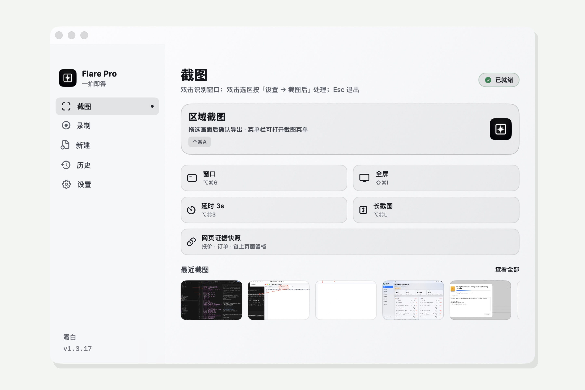
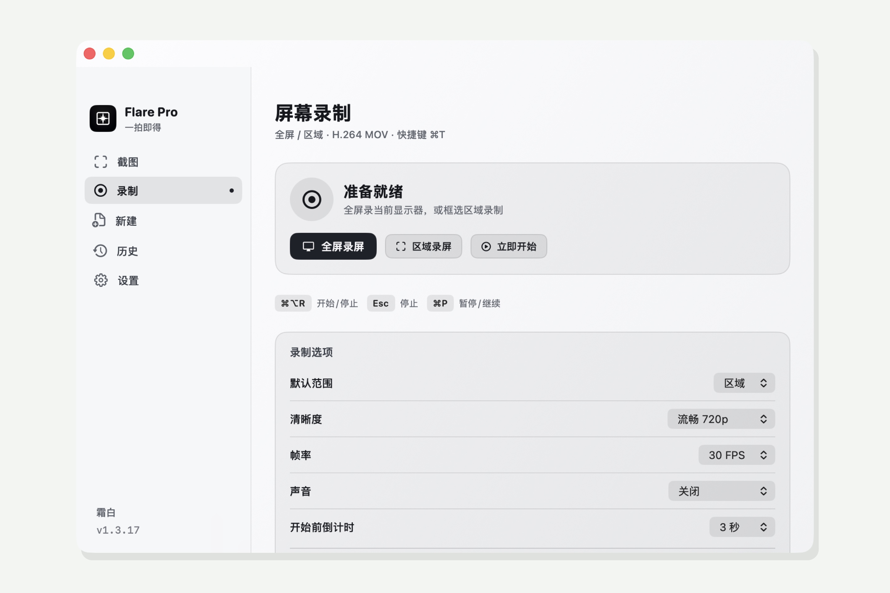
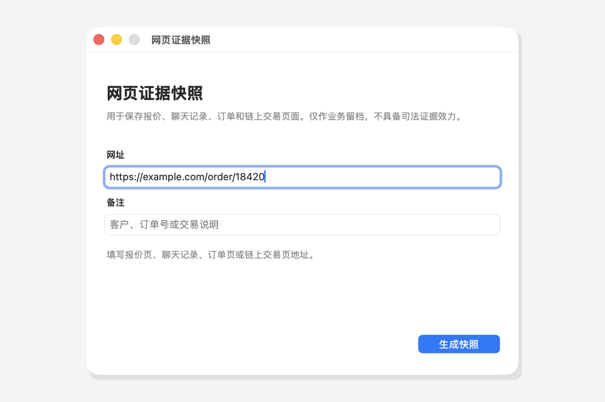

<p align="center">
  
</p>

<h1 align="center">Flare Pro</h1>

<p align="center">
  <strong>一拍即得</strong><br/>
  原生 macOS 截图 · 录屏 · 隐私脱敏 · 网页证据快照<br/>
  Windows / Android 也支持网页长截图
</p>

<p align="center">
  <b>中文</b> · <a href="README.en.md">English</a>
</p>

<p align="center">
  <a href="https://github.com/linux503/Flare/releases/latest"></a>
  <a href="https://linux503.github.io/Flare/"></a>
  <a href="https://github.com/linux503/Flare/releases"></a>
  <a href="https://github.com/linux503/Flare/releases"></a>
</p>

<p align="center">
  <a href="https://linux503.github.io/Flare/downloads/Flare-Pro-1.3.19-Universal.dmg"><strong>macOS DMG</strong></a>
  ·
  <a href="https://github.com/linux503/Flare/releases/download/v1.3.19/Flare-Windows-x64.exe"><strong>Windows EXE</strong></a>
  ·
  <a href="https://linux503.github.io/Flare/downloads/Flare-Android.apk"><strong>Android APK</strong></a>
  ·
  <a href="https://linux503.github.io/Flare/">官网</a>
</p>

---

<p align="center">
  
</p>

<p align="center"><sub>主面板 · 区域 / 窗口 / 全屏 / 长截图</sub></p>

<p align="center">
  
  &nbsp;
  
</p>

<p align="center"><sub>录屏 · 网页证据快照</sub></p>

---

## 亮点

| | |
|---|---|
| **截图一套齐** | 区域、窗口、全屏、延时、长截图；双击可按设置进入标注或直接复制 |
| **录屏独立成套** | 全屏 / 区域，系统声可选，导出 H.264 MOV；悬浮计时条不进成片 |
| **隐私安全模式** | 分享前本机检测 API Key、助记词、私钥、钱包、银行卡、证件、邮箱、电话、二维码、Token，可脱敏后分享 |
| **网页证据快照** | 记录网址、时间、长图、哈希、证书；能识别时记下区块高度；导出时间线 PDF（仅业务留档，不具备司法效力） |
| **新建文档** | 一键空白 TXT / Word / PPT / Excel |
| **跨平台长图** | Windows EXE、Android APK：打开网页自动滚动拼接 |

---

## 功能一览

### macOS

- **截图**：菜单栏单击即区域截图；右键打开完整菜单  
- **录屏**：顶部「录制」菜单、状态栏红点、`⌘⌥R` 开关  
- **标注 / OCR / 钉图 / 历史**：同一流程里改完、识别、钉桌面、回看  
- **隐私**：设置里可开关「隐私安全模式」与「发现后自动遮挡」  
- **证据快照**：菜单栏打开「网页证据快照」，填网址生成留档包  

### Windows / Android

- 下载后即用，无需复杂环境  
- 输入网页地址，自动滚动并拼成长图  
- 适合商品详情、聊天记录、文档页留档  

---

## 快捷键（macOS）

默认 **⌘⌥**，避开系统截图 ⌘⇧3 / 4 / 5。可在「设置 → 快捷键」修改。

| 功能 | 默认 |
|------|------|
| 区域截图 | `⌘⌥5` |
| 全屏截图 | `⌘⌥4` |
| 窗口截图 | `⌘⌥6` |
| 延时截图 | `⌘⌥3` |
| 开始 / 停止录屏 | `⌘⌥R` |
| 新建文档 | `⌘⇧D` |
| 历史记录 | `⌘⌥H` |
| 主面板 | `⌘O` |
| 确认选区 | `空格` / `回车` / 双击 |
| 停止录制 | `Esc` |
| 暂停 / 继续 | `⌘P` |

---

## 安装

### macOS 1.3.19

1. 下载 [Flare-Pro-1.3.19-Universal.dmg](https://linux503.github.io/Flare/downloads/Flare-Pro-1.3.19-Universal.dmg)  
2. 将 **Flare Pro** 拖入「应用程序」  
3. 只从 `/Applications/Flare Pro.app` 运行  

需要 **macOS 14+**（Universal：Apple Silicon + Intel）。

**屏幕录制权限**

1. 系统设置 → 隐私与安全性 → 屏幕与系统音频录制  
2. 打开 **Flare Pro**（灰色旧条目先删再勾）  
3. 完全退出后再打开；授权后会自动重启  

### Windows / Android

- [Flare-Windows-x64.exe](https://github.com/linux503/Flare/releases/download/v1.3.19/Flare-Windows-x64.exe) — 双击运行  
- [Flare-Android.apk](https://linux503.github.io/Flare/downloads/Flare-Android.apk) — 允许未知来源后安装  

---

## 从源码构建

```bash
git clone https://github.com/linux503/Flare.git
cd Flare
./Scripts/build.sh      # → dist/Flare Pro.app
./Scripts/install.sh    # 安装到 /Applications
./Scripts/make_dmg.sh   # 可选：打 DMG
```

| 路径 | 内容 |
|------|------|
| `Sources/Flare/` | SwiftUI / AppKit |
| `Resources/` | Info.plist、图标 |
| `Scripts/` | 构建、签名、安装、打包 |
| `docs/` | 官网（GitHub Pages）与 [`version.json`](docs/version.json) |

---

## 其它工具

| 应用 | 说明 |
|------|------|
| [ZipX](https://github.com/linux503/ZipX) | 压缩 / 解压 / 预览 |
| [MacText](https://github.com/linux503/MacText) | 原生文本编辑 |
| [SupTools](https://github.com/linux503/suptools) | 系统监控、清理、卸载 |
| [FilesDesk](https://github.com/linux503/FilesDesk) | 批量重命名 |
| [MacFan](https://github.com/linux503/MacFan) | 风扇转速 |
| [BattyBar](https://github.com/linux503/BattyBar) | 电池管理 |
| [RemoteX](https://github.com/linux503/RemoteX) | 远程桌面 |

---

## 许可

个人使用与学习欢迎。商业分发请先联系仓库所有者。问题与建议：[Issues](https://github.com/linux503/Flare/issues)。
